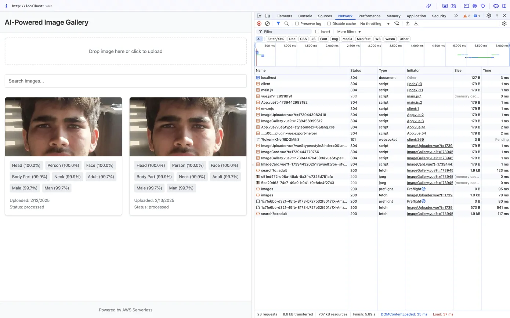

# AI-Powered Serverless Image Gallery

A serverless application built on AWS that provides AI-powered image analysis using Amazon Rekognition. The application automatically detects objects, scenes, and text in uploaded images, storing the analysis results for easy searching and retrieval.



## Architecture
The application uses several AWS services in a serverless architecture:
- Amazon S3 for image storage
- AWS Lambda for serverless computing
- Amazon DynamoDB for metadata storage
- Amazon Rekognition for AI-powered image analysis
- Amazon API Gateway for RESTful API endpoints
- Amazon CloudFront for content delivery

## Prerequisites
- AWS Account with appropriate permissions
- [AWS CLI](https://aws.amazon.com/cli/) installed and configured
- [Terraform](https://www.terraform.io/downloads.html) (v1.0.0 or later)
- [Node.js](https://nodejs.org/) 16+ for frontend development
- Python 3.8+ for Lambda functions

## Cost Considerations
This project uses AWS Free Tier eligible services, but there may be costs associated with usage beyond free tier limits:

- **Amazon Rekognition:**
  - First 1,000 images per month are free
  - $1.00 per 1,000 images after free tier
  - Text detection (OCR): Additional $1.00 per 1,000 images

- **Other Services (Free Tier Limits):**
  - Lambda: 1M free requests/month
  - S3: 5GB storage + 20,000 GET/PUT requests
  - DynamoDB: 25GB storage
  - API Gateway: First 1M API calls/month
  - CloudFront: 1TB outbound + 10M requests

## Installation & Deployment

1. **Clone the Repository**
   ```bash
   git clone https://github.com/Yash-Shindey/rekognitionServerless
   cd rekognitionServerless
2. **Configure AWS Credentials**
   ```bash
   aws configure
   ```
   Enter your AWS Access Key ID, Secret Access Key, and preferred region (e.g., ap-south-1)
4. **Initialise Terraform**
   ```bash
   terraform init
   terraform plan
   terraform apply
   ```
5. **Note the Outputs**
   After successful deployment, Terraform will output:

   - S3 bucket name
   - DynamoDB table name
   - API Gateway URL
   - Lambda function names


## Usage

**Upload Images**

- Use the web interface to upload images
- Images are automatically processed by AWS Rekognition
- Analysis results are stored in DynamoDB


**View and Search**

- Browse uploaded images in the gallery
- Search images based on detected objects, scenes, or text
- View detailed AI analysis for each image


**Cleanup**
To avoid unwanted AWS charges, remove all created resources when done:
```bash
terraform destroy
```

**Security Considerations**

The project implements secure IAM roles and policies
S3 bucket is configured with PUBLIC ACCESS with NO BLOCK
API Gateway endpoints use CORS protection
CloudFront provides HTTPS encryption

## Troubleshooting

### Common issues and solutions:

**Deployment Failures**

- Ensure AWS credentials are correctly configured
- Check if the region has all required services available
- Verify sufficient IAM permissions


**Image Processing Issues**

- Check CloudWatch logs for Lambda function errors
- Verify S3 bucket permissions
- Ensure image format is supported by Rekognition


**Contributing**
Pull requests are welcome. For major changes, please open an issue first to discuss what you would like to change. Thank You
 
